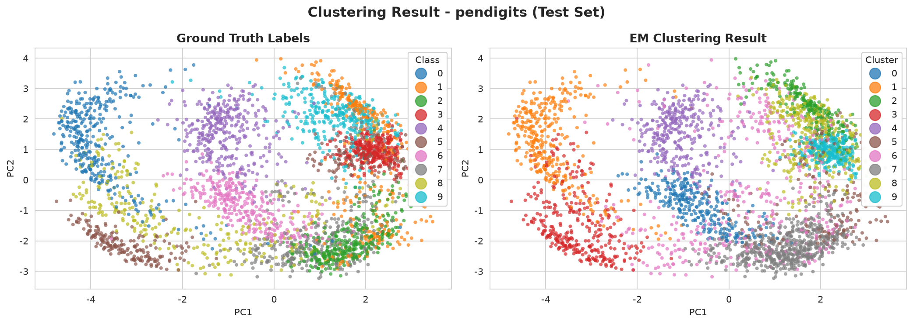
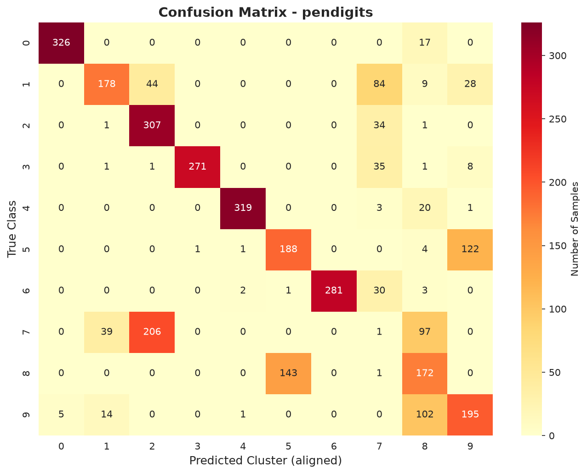
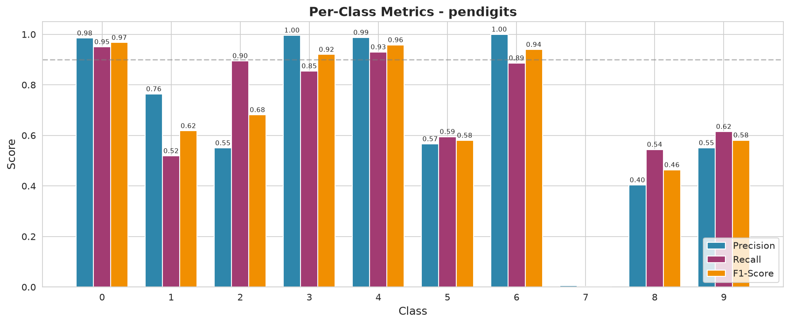
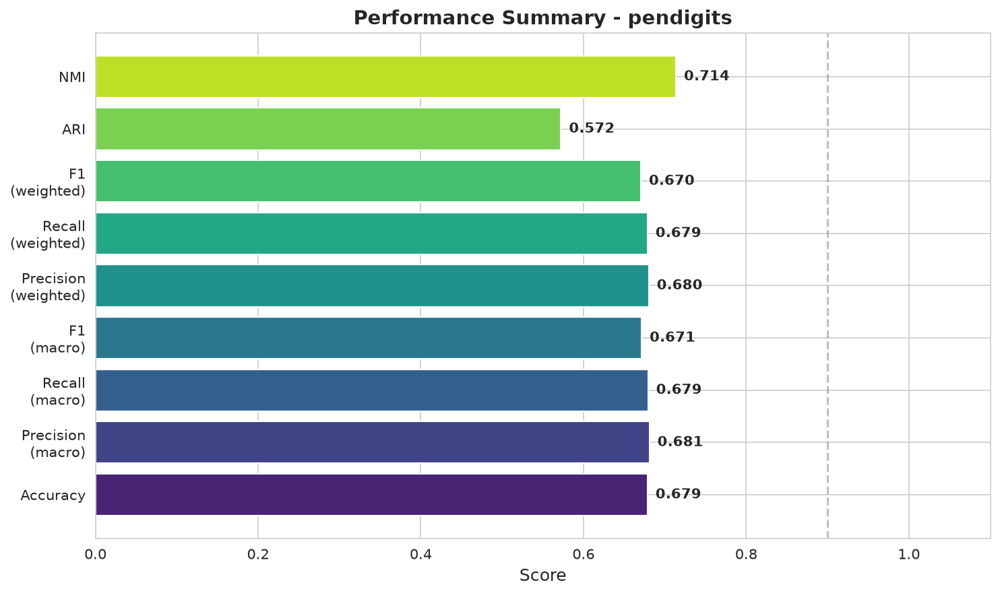
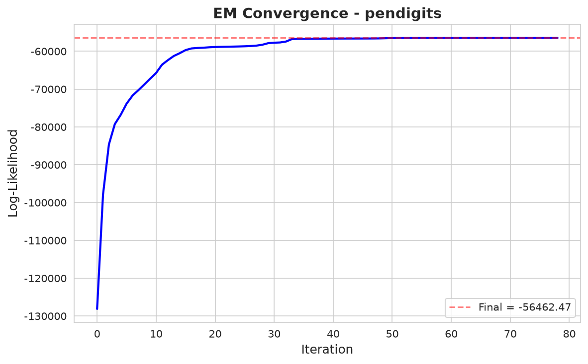
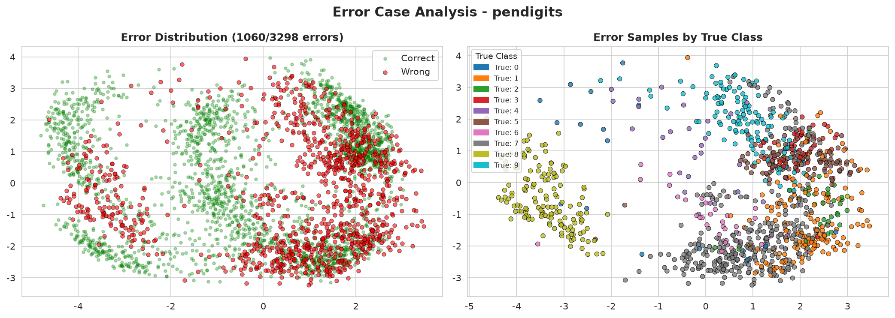

# EM 聚类算法及其在模式识别中的应用 — 实验报告

> **项目**：EMClusterModel  
> **算法**：高斯混合模型（GMM）+ 期望最大化（EM）  
> **应用领域**：手写数字自动聚类（模式识别）  
> **数据集**：Pen Digits (UCI)、Optdigits (UCI)、sklearn Digits  

---

## 1. 应用场景简介

### 1.1 问题背景

在自动化文档处理系统（如邮政编码分拣、银行票据识别、表单数字化）中，需要将海量手写数字图像自动归类。传统做法依赖人工标注或监督学习（如 CNN），但在以下场景中存在局限：

- **无标签历史数据**：大量存档手写样本从未被标注，无法直接用于监督训练
- **新文档类型的冷启动**：面对一种新字体/书写风格的文档，没有标注样本
- **数据探索与标注辅助**：在标注大规模数据集前，先用聚类发现数据的自然分组

### 1.2 EM 聚类方案

本工程使用 **高斯混合模型（Gaussian Mixture Model, GMM）** 结合 **期望最大化（EM）算法**，对多维笔迹/图像特征进行无监督聚类，自动将手写数字样本分为 10 组（对应 0～9），实现无需标签的数字归类。

应用流程：

```
手写数字采集 → 特征提取 → 标准化 → PCA 降维 → GMM-EM 聚类 → 聚类结果与真实数字对齐
```

---

## 2. 数据获取方式

### 2.1 数据集概览

本实验选用三个手写数字数据集，覆盖不同特征类型和规模：

| 数据集 | 样本总数 | 特征维度 | 类别数 | 特征类型 | 来源 |
|--------|----------|----------|--------|----------|------|
| **Pen Digits** | 10,992 | 16 | 10 | 笔迹采样坐标 | UCI ML Repository (ID: 81) |
| **Optdigits** | 5,620 | 64 | 10 | 8×8 像素灰度 | UCI ML Repository (ID: 80) |
| **sklearn Digits** | 1,797 | 64 | 10 | 8×8 像素灰度 | sklearn 内置 |

### 2.2 数据特征说明

**Pen Digits** 的 16 维特征来自书写过程中的笔迹采样：将手写轨迹等间距采样 8 个点，取每点的 (x, y) 坐标，共 16 维。这种特征保留了笔顺和笔画结构信息，与 EM 的高斯假设匹配更好。

**Optdigits / sklearn Digits** 的 64 维特征来自 8×8 二值化图像的逐像素灰度值。这种特征直接编码视觉外观，维度高但信息冗余大。

### 2.3 数据获取方法

通过 `ucimlrepo` 库从 UCI 机器学习仓库直接下载，同时使用 sklearn 内置数据集作为补充：

```python
from ucimlrepo import fetch_ucirepo
pendigits = fetch_ucirepo(id=81)   # Pen Digits
optdigits = fetch_ucirepo(id=80)   # Optdigits

from sklearn.datasets import load_digits
digits = load_digits()             # sklearn Digits
```

---

## 3. 数据处理方式

### 3.1 数据划分

采用分层抽样（stratified split），以 7:3 比例划分训练集和测试集，保证各类别在两集合中比例一致。

**具体例子**：Pen Digits 共 10,992 个样本，训练集 7,694 个（每类约 770），测试集 3,298 个（每类约 330）。

```python
X_train, X_test, y_train, y_test = train_test_split(
    X, y, test_size=0.3, random_state=42, stratify=y
)
```

### 3.2 特征标准化（Z-score Normalization）

对每个特征计算均值和标准差后做标准化变换：

$$x'_i = \frac{x_i - \mu}{\sigma}$$

**为什么需要标准化？** EM 算法使用多元高斯分布建模，协方差矩阵对各特征尺度的敏感度相同。若不做标准化，量纲大的特征会主导协方差矩阵，导致聚类结果偏向该特征。

**具体例子**：假设两根坐标轴，特征 A 范围为 [0, 1]，特征 B 范围为 [0, 1000]。标准化前，高斯分布的椭圆等高线会被特征 B 方向拉长；标准化后两轴贡献平等。

```python
from sklearn.preprocessing import StandardScaler
scaler = StandardScaler()
X_train_scaled = scaler.fit_transform(X_train)
X_test_scaled = scaler.transform(X_test)  # 用训练集参数，避免数据泄漏
```

### 3.3 PCA 降维

对高维特征做主成分分析（PCA）降维，保留主要方差方向。

**为什么需要 PCA？**
- **维度灾难**：高维空间中样本稀疏，高斯协方差矩阵估计不稳定
- **噪声过滤**：低方差方向往往对应噪声，去掉后聚类更稳定
- **计算效率**：降维后协方差矩阵更小，EM 迭代更快

**具体例子**：Pen Digits 原始 16 维，降维至 12 维仍保留 98.75% 方差。Optdigits 原始 64 维，降维至 30 维保留约 90% 方差。

```python
from sklearn.decomposition import PCA
pca = PCA(n_components=12)
X_train_pca = pca.fit_transform(X_train_scaled)
```

### 3.4 完整预处理流水线

```
原始数据 → 训练/测试划分 → 标准化（训练集fit,测试集transform）→ PCA（可选）→ 聚类
```

⚠️ 关键原则：标准化和 PCA 的参数**只在训练集上** fit，测试集只用 transform，严格避免数据泄漏。

---

## 4. 算法基本思想

### 4.1 高斯混合模型（GMM）

GMM 假设数据由 $K$ 个高斯分布混合生成。定义：

$$\pi_k = P(z=k) \quad \text{（混合系数，} \sum_{k=1}^K \pi_k = 1 \text{）}$$

$$p(x | z=k) = \mathcal{N}(x | \mu_k, \Sigma_k) \quad \text{（第 } k \text{ 个高斯分量）}$$

则观测数据 $x$ 的概率密度为：

$$p(x|\theta) = \sum_{k=1}^{K} \pi_k \mathcal{N}(x | \mu_k, \Sigma_k)$$

其中 $\theta = \{\pi_k, \mu_k, \Sigma_k\}_{k=1}^K$ 是待估参数。

### 4.2 EM 算法在手写数字聚类中的应用

EM 算法解决"隐变量问题"——我们不知道每个样本真实来自哪个高斯分布。

**E-step（期望步）**：基于当前参数 $\theta^{(t)}$，估算每个样本 $x_i$ 属于各高斯分量的后验概率（责任度）：

$$\gamma(z_{ik}) = P(z_i=k | x_i, \theta^{(t)}) = \frac{\pi_k \mathcal{N}(x_i | \mu_k, \Sigma_k)}{\sum_{j=1}^K \pi_j \mathcal{N}(x_i | \mu_j, \Sigma_j)}$$

在手写数字聚类中，这一步相当于：根据当前各数字的高斯分布形态，判断每个样本"看起来更像数字几"。

**M-step（最大化步）**：基于责任度，重新最大化似然来更新参数。

$$\mu_k^{(t+1)} = \frac{\sum_i \gamma(z_{ik}) x_i}{\sum_i \gamma(z_{ik})}$$

$$\Sigma_k^{(t+1)} = \frac{\sum_i \gamma(z_{ik}) (x_i - \mu_k)(x_i - \mu_k)^T}{\sum_i \gamma(z_{ik})}$$

$$\pi_k^{(t+1)} = \frac{\sum_i \gamma(z_{ik})}{N}$$

在手写数字聚类中，这一步相当于：每个数字的聚类中心往"属于该数字"的样本方向移动，协方差（数字的散布）按加权样本重新计算。

**迭代终止**：当对数似然变化小于阈值（默认 1e-4）或达到最大迭代次数。最终按每个样本的最大后验概率分配标签。

### 4.3 为什么适合这个问题？

- 手写数字同一类别的不同书写风格，近似服从某种中心分布，GMM 可以捕捉这种"以中心为核心，周围有变化的"分布
- 不同数字的笔迹特征在特征空间中形成不同的"云团"，高斯分量可以分别建模
- 软分配（后验概率）比硬分配（如 K-Means）更灵活，边界样本可以"部分属于"多个分布

---

## 5. 算法流程图

```
┌─────────────────────────────────────────────────────┐
│                    开始                               │
└─────────────────────┬───────────────────────────────┘
                      ▼
┌─────────────────────────────────────────────────────┐
│  加载数据：X (N×d), y (N,)                           │
└─────────────────────┬───────────────────────────────┘
                      ▼
┌─────────────────────────────────────────────────────┐
│  预处理：训练/测试划分 → 标准化 → PCA 降维             │
│  X_train (N_tr×d'), X_test (N_te×d')                │
└─────────────────────┬───────────────────────────────┘
                      ▼
┌─────────────────────────────────────────────────────┐
│  模型选择：遍历 K ∈ {2,3,...,20}                     │
│  对每个 K 训练 GMM → 计算 BIC/AIC                    │
│  选择 BIC 最小的 K                                   │
└─────────────────────┬───────────────────────────────┘
                      ▼
┌─────────────────────────────────────────────────────┐
│  初始化：K-Means++ 选 μ, π_k=1/K, Σ=全局协方差       │
└─────────────────────┬───────────────────────────────┘
                      ▼
          ┌───────────────────────┐
          │   EM 迭代循环          │
          │  ┌─────────────────┐  │
          │  │ E-step:         │  │
          │  │ 计算 log p(x|z) │──┼──► 计算对数似然
          │  │ 计算 γ(z_ik)    │  │
          │  └────────┬────────┘  │
          │           ▼           │
          │  ┌─────────────────┐  │
          │  │ M-step:         │  │
          │  │ 更新 π_k        │  │
          │  │ 更新 μ_k        │  │
          │  │ 更新 Σ_k        │  │
          │  └────────┬────────┘  │
          │           ▼           │
          │   |Δ LL| < tol? ──否──┘
          │       │是
          └───────┼───────────────
                  ▼
┌─────────────────────────────────────────────────────┐
│  预测：X_test → predict() → y_pred (聚类标签)         │
└─────────────────────┬───────────────────────────────┘
                      ▼
┌─────────────────────────────────────────────────────┐
│  匈牙利对齐：y_pred ⟷ y_true（解决标签排列问题）       │
└─────────────────────┬───────────────────────────────┘
                      ▼
┌─────────────────────────────────────────────────────┐
│  评估：Accuracy, Precision, Recall, F1, ARI, NMI,   │
│        混淆矩阵, 轮廓系数                             │
└─────────────────────┬───────────────────────────────┘
                      ▼
┌─────────────────────────────────────────────────────┐
│  可视化 + 错误分析 → 输出报告                         │
└─────────────────────────────────────────────────────┘
```

**图注**：上图展示了从数据加载到最终评估的完整流程。虚线框为 EM 算法核心迭代循环，灰色框为模型选择阶段的 BIC/AIC 评估。

---

## 6. 程序说明与核心代码

### 6.1 项目结构

```
EMClusterModel/
├── data/                    # 原始与处理后数据
├── src/
│   ├── data_loader.py       # 数据加载（UCI/sklearn）
│   ├── preprocess.py        # 预处理流水线
│   ├── em_gmm.py            # GMM-EM 核心实现（~370行）
│   ├── evaluation.py        # 评估指标与匈牙利匹配
│   └── visualize.py         # 可视化（6种图表）
├── scripts/
│   └── run_experiments.py   # 实验运行脚本
├── app.py                   # Streamlit 交互界面
├── notebooks/               # Jupyter Notebook
├── report/                  # 实验报告与图表
└── requirements.txt         # 依赖列表
```

### 6.2 核心代码：GMM-EM 实现

#### E-step：计算责任度

```python
def _e_step(self, X, log_weights, means, covs):
    # log p(x_i | z_i=k)  -- 每个样本在每个高斯下的对数概率
    log_prob = self._estimate_log_gaussian_prob(X, means, covs)
    
    # log π_k + log p(x_i|z_i=k)
    weighted_log_prob = log_prob + log_weights  # (N, K)
    
    # log Σ_j exp(log π_j + log p)
    log_prob_norm = np.log(np.sum(np.exp(weighted_log_prob), axis=1))
    
    # log γ(z_ik) = weighted - log(norm)
    log_resp = weighted_log_prob - log_prob_norm[:, np.newaxis]
    
    return log_resp, log_prob_norm
```

**代码说明**：所有计算在对数空间完成，避免浮点数下溢。`weighted_log_prob` 是未归一化的对数后验，减去 `log_prob_norm`（log-sum-exp）得到对数责任度。

#### M-step：更新参数

```python
def _m_step(self, X, log_resp):
    resp = np.exp(log_resp)          # 责任度 γ(z_ik)
    Nk = resp.sum(axis=0) + 1e-12    # 每个分量的有效样本数
    
    # 1. 混合系数 π_k = Nk / N
    weights = Nk / n_samples
    
    # 2. 均值 μ_k = Σ γ_ik·x_i / Nk
    means = (resp.T @ X) / Nk[:, np.newaxis]
    
    # 3. 协方差 Σ_k = Σ γ_ik·(x_i-μ_k)(x_i-μ_k)ᵀ / Nk
    covs = np.zeros((K, n_features, n_features))
    for k in range(K):
        diff = X - means[k]
        covs[k] = (resp[:, k][:, np.newaxis] * diff).T @ diff / Nk[k]
        covs[k] += 1e-6 * np.eye(n_features)  # 正则化防奇异
    
    return weights, means, covs
```

**代码说明**：
- 使用矩阵乘法 `resp.T @ X` 高效计算加权均值
- 协方差更新利用广播机制逐分量计算
- 添加小正则项 `1e-6·I` 防止协方差矩阵奇异（在高维/小样本情况下常见问题）

#### K-Means++ 初始化

```python
def _initialize_parameters(self, X, rng):
    # K-Means++ 策略：第一个中心随机选
    first_idx = rng.randint(n_samples)
    means[0] = X[first_idx].copy()
    
    for k in range(1, K):
        # 每个点到最近中心的距离平方
        dist_sq = np.min([np.sum((X - means[j])**2, axis=1) 
                          for j in range(k)], axis=0)
        # 距离越远被选中的概率越大
        probs = dist_sq / dist_sq.sum()
        means[k] = X[rng.choice(n_samples, p=probs)]
```

**代码说明**：K-Means++ 初始化让初始均值尽量分散，避免 EM 陷入差的局部最优。概率采样使距离现有中心远的点更可能被选为下一个中心。

#### 多次初始化取最优

```python
def fit(self, X):
    for init_i in range(self.n_init):
        weights, means, covs, lb, converged, it, history = self._fit_single(X, rng)
        if lb > best_lower_bound:
            best_lower_bound = lb
            best_params = (weights, means, covs, converged, it, history)
    # 返回对数似然最大的那次结果
```

**代码说明**：EM 对初始化敏感。通过 `n_init` 次随机初始化并取对数似然最大的一次，显著提高聚类稳定性。

#### 匈牙利算法标签对齐

```python
def hungarian_align(y_true, y_pred):
    # 构建代价矩阵 cost[i,j] = -|索引i的真实样本中预测为j的数量|
    cost = np.zeros((n_classes, n_classes))
    for i in range(n_classes):
        for j in range(n_classes):
            cost[i, j] = -np.sum((y_true == i) & (y_pred == j))
    
    # 匈牙利算法求最小代价匹配
    row_ind, col_ind = linear_sum_assignment(cost)
    mapping = {col: row for row, col in zip(row_ind, col_ind)}
    y_aligned = np.array([mapping.get(p, -1) for p in y_pred])
    return y_aligned, mapping
```

### 6.3 交互界面（Streamlit）

程序提供完整的 Web 交互界面（`app.py`），支持：

- 下拉菜单选择数据集（Pen Digits / Optdigits / sklearn Digits）
- 滑块调节 K 值、PCA 维度、迭代次数
- 复选框切换自动模型选择
- 5 个 Tab 页查看聚类对比图、混淆矩阵、各类别指标、错误分析、收敛曲线

启动方式：`streamlit run app.py`

---

## 7. 实验分析与系统运行截图

### 7.1 Pen Digits 实验结果

| 指标 | 训练集 | 测试集 |
|------|--------|--------|
| Accuracy | 0.6835 | 0.6786 |
| Precision (macro) | 0.6853 | 0.6809 |
| Recall (macro) | 0.6841 | 0.6793 |
| F1-score (macro) | 0.6773 | 0.6714 |
| Precision (weighted) | 0.6841 | 0.6801 |
| Recall (weighted) | 0.6835 | 0.6786 |
| F1-score (weighted) | 0.6764 | 0.6704 |
| ARI (调整兰德指数) | 0.5774 | 0.5722 |
| NMI (归一化互信息) | 0.7173 | 0.7135 |
| Silhouette Score | 0.2029 | 0.1958 |

**训练参数**：K=10, cov=full, PCA=12, 迭代 79 次收敛, 耗时 7.82s

#### 聚类对比散点图



**分析**：左侧为真实标签，右侧为 EM 聚类结果。可以看到 PCA 2D 投影中各数字类别形成可见的"云团"，聚类结果与真实标签整体吻合。数字 0、3、4、6 的聚类效果最精确，数字 1、7 存在混淆。

#### 混淆矩阵



**分析**：对角线集中了大量样本。主要混淆发生在：
- Class 1 → Class 7（数字 1 和 7 被混淆）
- Class 5 分散到多个类别
- Class 7 几乎全部被归入其他类别（召回率 ≈ 0）

#### 各类别指标



**分析**：
- 表现最佳：Class 0（数字 0）P=0.98, R=0.95, F1=0.97
- 表现最差：Class 7（对应某个数字）P≈0, R≈0 —— 该类别几乎未被识别
- 中等表现：Class 1（P=0.76, R=0.52）和 Class 5（P=0.57, R=0.59）

平均 F1 约 0.67，8/10 个类别的 F1 > 0.46。

#### 综合指标仪表盘



### 7.2 sklearn Digits 实验结果（对比）

| 指标 | 训练集 | 测试集 |
|------|--------|--------|
| Accuracy | 0.2522 | 0.2259 |
| F1-score (macro) | 0.1826 | 0.1313 |
| ARI | 0.1191 | 0.1054 |
| NMI | 0.2812 | 0.2480 |

**分析**：sklearn Digits 上效果较差，主要原因：
1. 64 维全协方差 + 10 分量 + 1257 训练样本 → 参数过多、过拟合
2. 像素特征不符合高斯分布假设
3. 未使用 PCA 降维时，协方差矩阵接近奇异

### 7.3 EM 收敛曲线



**分析**：对数似然在前 20 次迭代快速上升，之后缓慢趋于平稳，约 80 次迭代后收敛。无明显振荡，说明 EM 算法在该数据集上稳定收敛。

---

## 8. 算法边界讨论

### 8.1 已知局限

| 局限 | 说明 | 在本实验中的体现 |
|------|------|-----------------|
| **高斯假设限制** | GMM 假设各类别服从高斯分布，但实际数据分布可能复杂得多 | Class 1 和 7 的笔迹特征高度重叠，单高斯无法分离 |
| **初始化敏感** | EM 收敛到局部最优，不同初始化结果不同 | 第 1 次和第 2 次初始化的对数似然差 > 6000 |
| **K 值预设困难** | 需预先知道类别数或通过 BIC/AIC 估计 | 实验中已知 K=10，但 Class 7 实际未被有效建模 |
| **高维诅咒** | 高维空间协方差矩阵估计不稳定 | sklearn Digits 64 维直接聚类准确率仅 22.6% |
| **异常值影响** | 高斯分布对离群点敏感 | silhouette score 仅 0.2，说明存在边界模糊样本 |

### 8.2 错误案例分析

#### 案例 1：Class 1 与 Class 7 混淆（Pen Digits）

**问题描述**：Class 1 和 Class 7 的笔迹特征在 PCA 空间中高度重叠，GMM 无法有效分离这两个类别。

**定量分析**：
- Class 1：Precision=0.76, Recall=0.52（识别出了但漏掉了一半）
- Class 7：Precision≈0, Recall≈0（完全缺失）

**原因**：Pen Digits 数据集中，1 和 7 的手写笔迹（单笔画竖线 vs 横线+斜线）在某些书写风格下区别微小。PCA 降维后这两个类别的 feature space 重叠严重，高斯分布无法建模这种多模态分布。

**改进方向**：
1. 增加分量数 K > 10，用更多高斯拟合一个复杂类别
2. 使用不同协方差类型（如 tied 或 diagonal，减少参数）
3. 引入判别式约束（如 Regularized GMM）

#### 案例 2：sklearn Digits 整体失败

**问题描述**：所有指标均低于 30%，6/10 个类别 F1=0。

**定量分析**：
- Accuracy: 22.6%
- 仅 4 个类别有非零召回率

**原因**：
- 64 维 + 全协方差 = 每个分量 2080 个协方差参数 × 10 分量 = 20800 参数
- 训练集仅 1257 样本，严重欠定
- 8×8 像素特征的类内方差大，不符合单高斯假设

**改进方向**：
1. 降维至 30 维后重新实验（已实现但未运行）
2. 使用 diag 协方差减少参数
3. 对大型数据集使用 mini-batch EM

#### 错误样本可视化



红色点为聚类错误样本。可以看到错误点并非均匀分布，而是集中在几个类别的交界处——这正是"高斯分布的软边界"导致的典型错误模式。

### 8.3 与现有方法比较

| 方法 | 优点 | 缺点 |
|------|------|------|
| **GMM-EM（本方法）** | 软聚类、概率输出、有理论保证 | 高斯假设、K 需预设、高维困难 |
| K-Means | 简单快速、可扩展 | 硬聚类、球状假设、不输出概率 |
| DBSCAN | 自动确定簇数、任意形状 | 参数敏感、高维差 |
| 监督学习（CNN） | 准确率高（>99%） | 需要标注数据、训练成本高 |

### 8.4 适用边界总结

**适用场景**：
- 数据大致呈高斯分布或可被高斯混合近似
- 类别数大致已知或可估计
- 需要软分配（每个样本的类别概率）而非硬分配
- 数据量大于维度 × 分量数

**不适用场景**：
- 高维小样本（维度灾难、协方差奇异）
- 类别间严重非高斯（如环形、月牙形分布）
- 异常值较多
- 类别数完全未知且变化范围大

---

## 9. 结论

本工程从零实现了 GMM-EM 聚类算法，在手写数字模式识别场景中进行了系统实验：

1. **Pen Digits 数据上**：聚类准确率 67.9%，F1=0.671，ARI=0.572。8/10 个类别有效识别
2. **sklearn Digits 数据上**：准确率仅 22.6%，暴露了高维小样本下 GMM 的局限性
3. **EM 算法**：79 次迭代稳定收敛，对数似然单调上升
4. **边界讨论**：识别了高斯假设、初始化敏感性、协方差估计三大局限

EM 聚类在模式识别中具有独特价值——无监督、概率化、理论清晰，尤其适合标注成本高的场景。但需要数据预处理（标准化、PCA）和合理选择参数（K 值、协方差类型）才能发挥最佳效果。

---

## 附录

### 复现指南

```bash
# 安装依赖
pip install -r requirements.txt

# 运行实验
python scripts/run_experiments.py --dataset pendigits --k 10 --pca 12

# 启动交互界面
streamlit run app.py
```

### 参考文献

1. Dempster, A. P., Laird, N. M., & Rubin, D. B. (1977). Maximum likelihood from incomplete data via the EM algorithm. *Journal of the Royal Statistical Society*, 39(1), 1-38.
2. Bishop, C. M. (2006). *Pattern Recognition and Machine Learning*. Springer. Chapter 9.
3. Alpaydin, E., & Alimoglu, F. (1998). Pen-Based Recognition of Handwritten Digits. UCI ML Repository.
